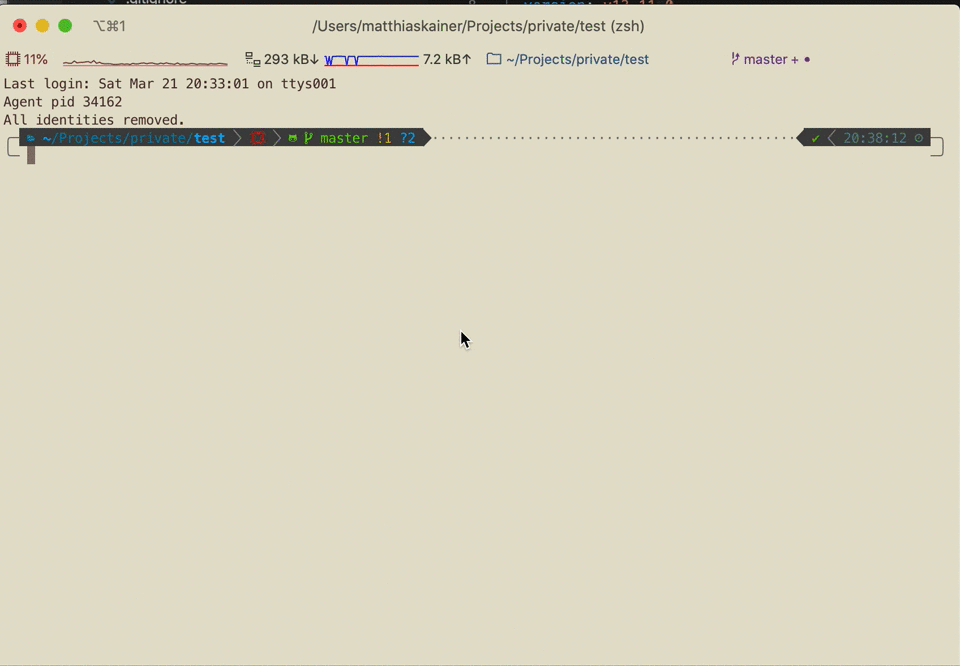

# ZSH Modes

Isolated ssh keys, git settings and env-variables in a single zsh session.



## Why

I have to switch between multiple ssh/git/envs in multiple terminal-tabs. That's a quick and dirty solution for this usecase.

## Install

First, git clone this directory, i.e. via

`git clone https://github.com/MatthiasKainer/zsh-lightweight-modes.git ~/.zsh/plugins/zsh-lightweight-modes`

Then, add the plugin to your zsh as you would. If have no idea what I'm talking about then add the following line to your `.zshrc`:

```sh
source '/Users/YOURUSER/.zsh/plugins/zsh-lightweight-modes/modes.zsh'
```

And reload you zsh. Now you can type `mode` and tab to see all modes you have available.

## Adding a mode

Open the directory where you installed the plugin, and add a new file into the `configs/` directory, with the extension `config`

The format is similar to yaml (however it is not - see below), and looks like this:

```yml
git:
  user:
    name: Example
    email: mail@example.com
env:
  quick: example
  anotherquick: "another-example"
  yetanotherquick: "another example"
ssh:
  file: /Users/example/.ssh/id_rsa
nvm:
  version: v12.15.0
jenv:
  version: openjdk64-11.0.2
p10k:
  prompt:
    icon: "🏃"
    text: quick
    foregroundColor: white
    backgroundColor: white
```

| config | value |
| -- | -- |
| **git.user.name** | Your committer-name in this mode |
| **git.user.email** | The email for the committer |
| **env.*** | A list of environment variables to set for this mode |
| **ssh.file** | the location of the default ssh file to use in this mode |
| **jenv.version** | Sets the current jenv (java version) for this mode. `jenv` and the version have to be installed |
| **nvm.version** | Sets the current nvm (node version) for this mode. `nvm` and the version have to be installed |
| **p10k.prompt.icon** | If you use p10k, set this to have an icon in your prompt to see which mode you're in |
| **p10k.prompt.text** | If you use p10k, set this to have text in your prompt to see which mode you're in |
| **p10k.prompt.foregroundColor** | If you use p10k, set this to specify the foreground color (i.e. text) |
| **p10k.prompt.backgroundColor** | If you use p10k, set this to set the background color |

## NOT YAML

Note that this config supports only a subset of yaml at the moment. Fields have always to be nested, chars like `-` are not supported in the names, and probably plenty more. Pls do create a pr if you have a better way to parse yaml in a shell.

## Config p10k

Add `currentMode` to your prompt elements, i.e. in your `.p10k.zsh` file.
